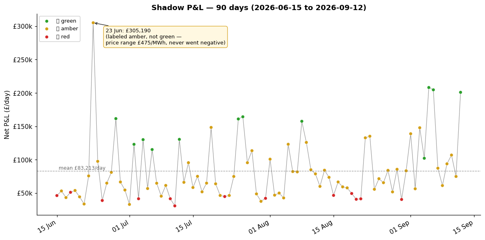

## shadow_pnl_90day_outlier_day_labeled_amber

**Finding:** the single best day across all 90 days of shadow P&L (23 Jun 2026, £305,190) is labeled "amber" — not "green," the label reserved for the highest-volatility days.

**Why:** `classify_day()` requires a negative minimum price to earn "green," regardless of how wide the range is. 23 Jun had a £475/MWh range (£85 to £561) but never dipped negative, so it's bucketed with much calmer amber days.

**Why it matters:** if "green vs amber" is ever used as a quick filter (e.g. to sanity-check which days are worth digging into, or as a feature for the forecaster), this day would be missed despite being the most profitable day on record. The classifier is compressing two different things — "how wide is the range" and "did price go negative" — into one label, and losing the first when the second is false.

**Not urgent, not code-breaking** — P&L itself is computed correctly regardless of the label; this is a labeling/visibility gap, not a financial one. Worth a look if day-type is ever relied on for filtering or as a model input.

---

