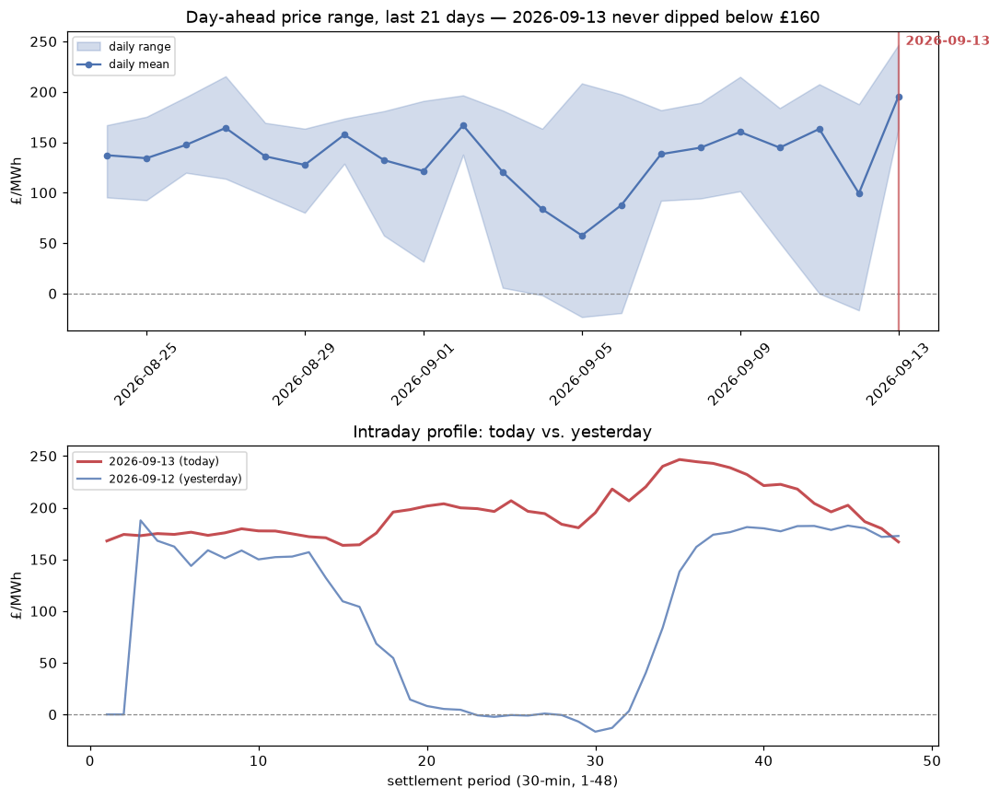

## No cheap charging window on 2026-09-13

**What stood out:** 2026-09-13's day-ahead price never dipped below about £160/MWh all day (range £163.57-£246.58, mean £195.48) — the highest daily floor of the last 21 days by a wide margin. Every other day in this window had at least one substantial trough, and several recent days (09-04, 09-05, 09-06, 09-12) went negative or near-zero for multiple hours.

**Why it matters:** the VPP's core edge is charging in cheap/negative-price troughs and discharging into peaks. A day with no cheap window at all removes half of that opportunity — there's nowhere cheap to charge. This shows up in today's shadow log: da_net revenue (£50,951) is on the lower side of the last two weeks despite the very high absolute price level, consistent with the batteries having little room to arbitrage. Total net P&L (£68,929) still came in reasonably given the high overall price level, but the *shape* of the day was unusually unfavourable for the strategy, not unusually favourable.

**Urgency:** not urgent, and not a data quality issue — settlement periods are complete (48/48) and the intraday shape (steady climb into an evening peak) is plausible for a genuine low-wind/high-demand day. Worth keeping an eye on if this pattern repeats over consecutive days, since a run of no-trough days would compress arbitrage margin more than the headline £/day figure alone would suggest.

---

