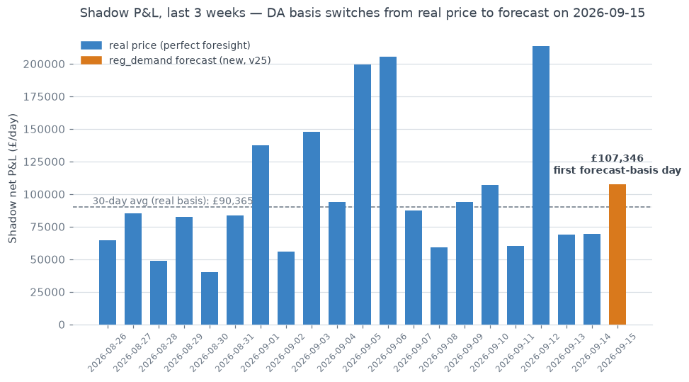

## first day dispatched on forecast basis (reg_demand) not real price

**What stood out:** 2026-09-15 is the first day in the entire 93-day shadow-log
history where the DA leg was dispatched against a genuine forecast (`reg_demand`,
wired in by v25) instead of the real settled price. Every prior row (92/92) used
`da_basis = "real"`; this is row 93 and the first `"reg_demand"` row.

**Why it matters:** this is the moment shadow P&L stops being pure
backward-looking perfect-foresight-adjacent numbers and starts reflecting what a
forecast-driven dispatch would actually have earned — the methodology shift this
project has been building toward (see BRIEFING.md §10d/10e). Worth having on
record as the exact date the switch took effect operationally, not just when it
was coded.

**Is it a problem?** No — net P&L on the day (£107,346) landed comfortably above
the trailing 30-day average for real-basis days (~£90,365), and BRIEFING.md
already documents the expected forecast-vs-perfect-foresight gap (~87% capture)
from offline backtests. One day is not a trend; this is a note for the record,
not an alert.

**Not urgent** — flagging for visibility only.

---

