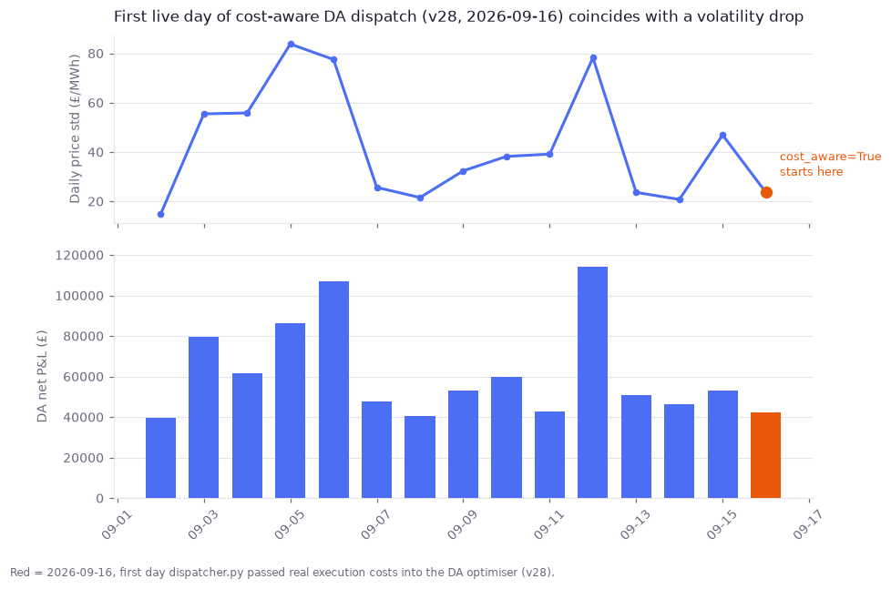

## First live cost-aware dispatch day vs price volatility

**What stood out:** 2026-09-16 is the first day the shadow log reflects `cost_aware=True` — v28 (merged 2026-09-16) wired real execution costs into the live DA dispatch for the first time; the 92 days before it in `shadow_pnl.csv` were all cost-blind by construction (backfilled `False`).

DA net fell to £42,378 from £53,205 the day before (‒20.4%), a bigger drop than the −5.2% the v28 commit measured in its own controlled same-day re-run (2026-09-15, before vs. after, holding the day fixed).

**Why this isn't yet a clean read:** 2026-09-16's price series was also much calmer than 09-15 — daily price std dropped from £46.9 to £23.7/MWh (range £117.77–£206.12 vs £46.33–£212.39). Lower spread mechanically limits arbitrage profit regardless of cost-awareness, so today's single data point can't separate "cost-awareness is doing its job" from "it was just a quieter trading day." The commit's own before/after re-run (same day, with vs. without costs) is still the more reliable estimate of the effect size.

**Not urgent — nothing broken.** This is a note for the next few days: once a handful of `cost_aware=True` days accumulate, a proper matched comparison (similar volatility/day_type) against the pre-v28 baseline will be possible. Flagging now so the single-day drop isn't mistaken for the full effect if someone glances at the shadow log before that comparison exists.

---

