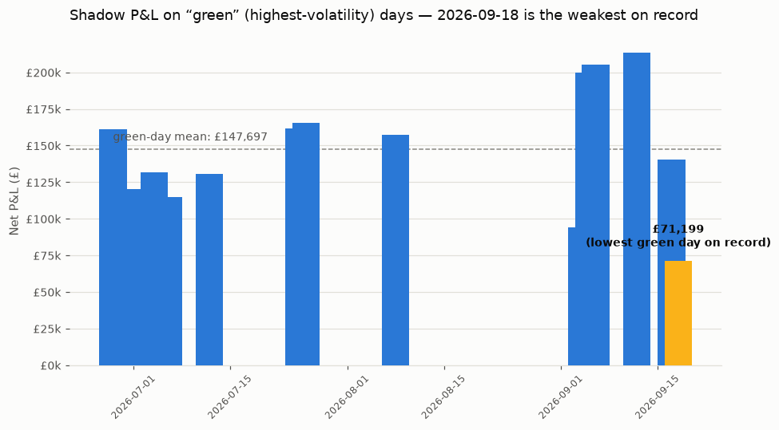

## Weakest green day on record: 2026-09-18

**What stood out:** 2026-09-18 is classified a "green" day (`day_type`, the highest-volatility bucket used for days with a wide price range and a negative dip — today's range was £-0.50 to £167.78) but earned only £71,199 net P&L, the lowest of all 14 green days in the full shadow-log history (mean £147,697, previous low £93,896 on 2026-09-04).

**Why:** it isn't a simple story of "prices were calmer than usual" — price std on 09-18 (£53.8) is close to 09-17's (£57.8, which earned £140,480, almost double). What stands out instead is that every leg is weak simultaneously: da_net £43,808 (lowest of any green day), id_net £9,931, and bm_net £17,460 are all well below their typical green-day levels. 09-18 is also the third consecutive day of falling mean price (£154 → £99 → £79 for 09-16/17/18) and the second straight day with a negative price dip, so the market itself has been trending toward thinner, cheaper conditions — which can compress arbitrage margin even on a day the classifier still calls "green" because of the range/negative-price rule.

**Is it a data quality issue?** No — both days have complete 48/48 settlement periods, and demand/price feeds look normal in shape. This also isn't the cost-aware effect on its own: 09-18's cost_ratio (total_cost / total_revenue = 0.28) sits in the middle of the three cost_aware=True days so far (0.19–0.58), not at the high end.

**Urgency:** not urgent, not code-breaking. Flagging because the day_type label (green/amber/red) is being used elsewhere as a quick filter for "how good a trading day was" (see the 2026-09-13 finding on the same classifier), and this is now the second instance of that label mapping to a P&L outcome outside its usual range — worth a look once a few more cost_aware days accumulate, to see whether this is a one-off quiet green day or the start of the classifier's range/negative-price rule becoming a weaker predictor of P&L now that dispatch is forecast-driven and cost-aware rather than perfect-foresight.

---

