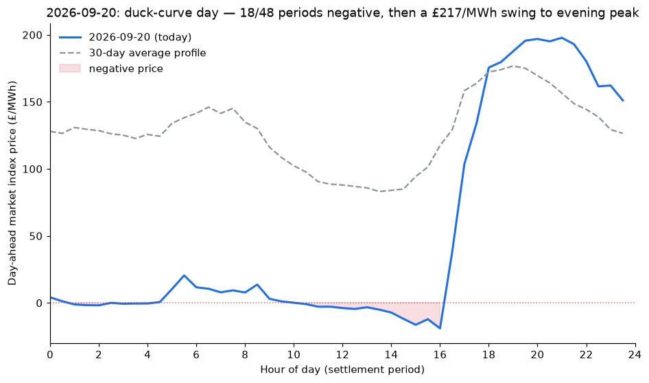

## duck curve day 2026-09-20 record negative price periods

Text summary: 2026-09-20 tied 2026-07-26 for the most negative-price settlement periods in the last 60 days (18 of 48, vs a typical 0-4). Prices sat at or below zero from ~00:00 through ~16:30 (trough -£19.03/MWh at period 33), then swung sharply positive, hitting £197.83/MWh by period 43 (~21:00) — a same-day range of ~£217/MWh, the kind of duck-curve pattern (wind/solar glut midday, tight evening ramp) that a battery is built to arbitrage.

Shadow P&L reflects it: net_pnl £170,358 was the second-best day in the last two weeks, and total_cost came out *negative* (£-6,915) — not a data quality issue, just the mechanical result of charging during negative-price periods, which pays the battery rather than costing it.

Not urgent — no data quality concern, this is the market doing exactly what a VPP should profit from. Flagging because it's the sharpest single-day price swing seen in this run so far and worth keeping in mind if forecast-accuracy or capture-ratio numbers look off for this date (regression-based forecasts tend to underfit these sharp discontinuities).

---

