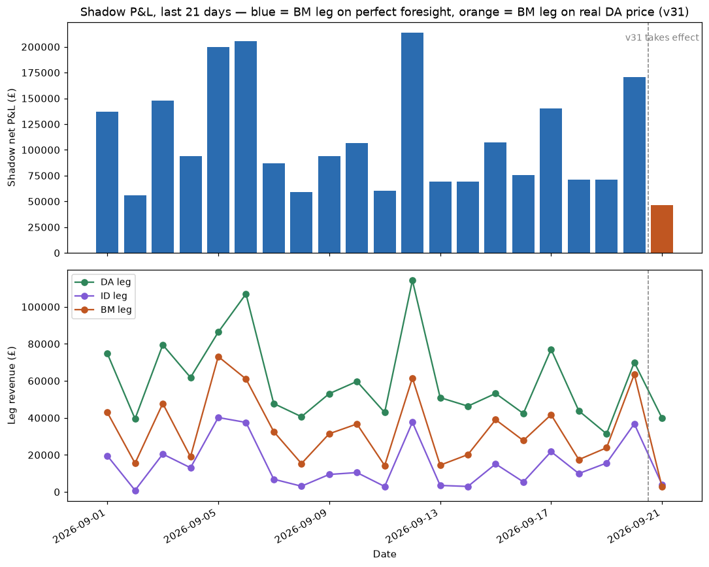

## v31 BM leg basis change hits the shadow log

**What this shows:** On 2026-09-21 the daily pipeline shadow-logged the first day under v31
(commit `6a9f934`, "BM leg decides on the real DA price instead of the future"). Before this,
`bm_basis` was `foresight` for all 98 prior rows; 2026-09-21 is the first `real_da` row.

**Effect:** BM leg revenue dropped from £63,562 (09-20) to £2,678 (09-21) — about -96% day over
day — and total shadow net P&L fell from £170,358 to £46,550 (-73%). DA and ID legs moved only
modestly by comparison (see bottom panel), so the drop is specifically the BM leg losing its
perfect-foresight advantage, exactly as the v31 commit message describes and as the follow-up
commit's 60-day pilot predicted (BM leg loses look-ahead bias once it decides on the real DA price
instead of the future price).

**Is it urgent?** No — this is expected, intentional, already-documented behaviour (see
`models/shadow.py` lines 47-66 and the "v31 follow-up" commit from 2026-09-21). Flagging it only
because a single-day P&L chart from here on will show what looks like a cliff at 2026-09-21; this
note is the explanation so it isn't read as a data problem. One caveat: this is n=1 day under the
new basis, so the -73% net_pnl move is not yet a stable read on v31's steady-state size — worth
another look once a few more `real_da` days have accumulated.

---

