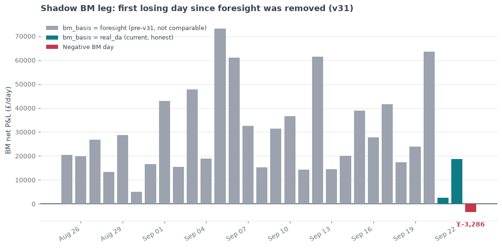

## First BM loss since real_da methodology (v31)

**What stood out:** 2026-09-23 is the first day in the entire shadow P&L log with a
**negative BM leg** (`bm_net` = -£3,286), and the lowest `net_pnl` in 30+ days
(£33,165 vs a 30-day mean of £95,461). DA and ID both stayed solidly positive that
day (£32,551 and £3,900), so this is a BM-specific event, not a bad market day overall.

**Why it's worth flagging, not just noise:** `bm_basis` switched from `foresight`
(perfect-foresight BM decisions, all history through 2026-09-20) to `real_da` (BM
decides on the real day-ahead price, no foresight) as of v31 on 2026-09-21 — see
BRIEFING.md's v31 entry. Only 3 days of `real_da` history exist so far
(09-21, 09-22, 09-23), and BRIEFING.md's own 200-day standalone bake-off for this
exact decision method explicitly reported **"no losing days"** (real DA price,
84.1% of the foresight ceiling, £36.9k/day). Seeing a loss this early — on only the
3rd live day of the new methodology — is either an early counter-example to that
"no losing days" finding, or a one-off (e.g. DA and imbalance prices diverging
sharply in some periods on 09-23). Not urgent (one day, small loss relative to
total net_pnl which is still solidly positive at £33k), but worth watching over the
next 1-2 weeks: if losing BM days keep recurring under `real_da`, it would update
the v31 bake-off's "no losing days" claim and is worth a dedicated look, not just a
sense-check note.

**Not investigated further here** (out of scope for a sense-check): whether the
09-23 loss traces to a specific settlement period where DA and imbalance price
diverged — that would need the underlying `bm_schedule_2026-09-23.csv`, which this
check didn't open.

---

