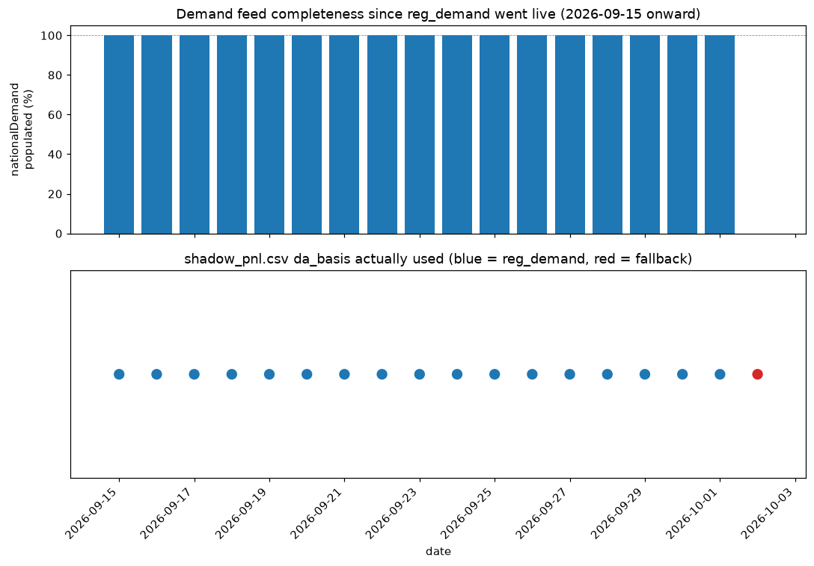

## demand_feed_gap_2026-10-02

**What happened:** On 2026-10-02, the `demand_2026-10-02.csv` feed's `nationalDemand` column
came back 100% empty (0/58 settlement periods populated). Every day from 2026-09-15 (when
`reg_demand` became the production default per BRIEFING.md v25/v27) through 2026-10-01 had it
100% populated — this is the first gap in that window.

**Consequence:** `shadow.py`'s documented fallback (BRIEFING.md section 17: "automatic fallback to
`mean_7` if `reg_demand`'s wind/solar/demand inputs are unavailable for a date") kicked in exactly
as designed. 2026-10-02 is the first non-`reg_demand` day since the rollout — every one of the
prior 17 days used `reg_demand`.

**Why it matters:** per BRIEFING.md section 10/10c, `reg_demand` beats `mean_7` by roughly +7-9%
in cost-aware P&L capture, so 2026-10-02's shadow P&L (net £59,306) sits on the weaker forecast and
isn't directly comparable to the surrounding `reg_demand` days. Not urgent — the fallback worked
exactly as designed and no trades (real or shadow) were lost — but worth a one-day watch: if
`nationalDemand` drops out again tomorrow, that would point to a real upstream Elexon publication
issue rather than a one-off gap.

---

